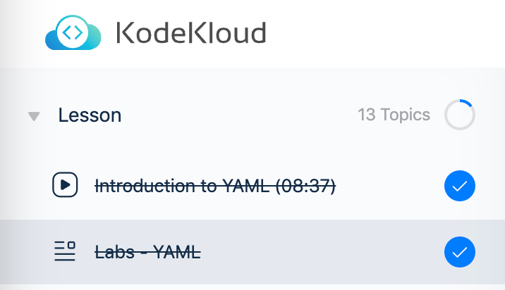

# docker-practice-for-beginners

[Udemy] 초보자를 위한 Docker 실습
[Docker 교육 사이트] https://dockerlabs.collabnix.com/

## Docker 개요

### 도커가 필요한 이유

- Compatibility, Dependency: 호환성 문제
- Long Setup Time
- 같은 운영체제로 컨테이너 분리
- 운영체제 커널이 동일하고 그 위에서 도커가 운영됨
- 도커는 모든 운영체제와 호환되는 Docker 호스트의 기반 커널을 활용
- 윈도우와 맥은 리눅스 가상머신을 사용하여 도커의 컨테이너를 사용
- 가상 머신은 용량이 무겁지만 도커의 컨테이너는 가벼우며 부트가 쉬움

### 도커 작동 원리

- docker run 명령어를 사용하여 애플리케이션 실행
- 간단하게 생성 및 삭제 가능

## Docker Command

- docker run
- docker ps
- docker ps -a
- docker stop [ID or NAMES]
- docker rm [ID or NAMES]
- docker images
- docker rmi [image]
- docker pull [image]
- docker run ubuntu sleep 5
- docker exec [NAMES] cat /etc - 명령어 실행
- docker run -d [image] - 백그라운드 실행
- docker attach [ID or NAMES]

## Docker Run

- -tag : 버전 관리
- -i : interactive, 값 입력
- -t : terminal
- -it : 터미널 대화 모드
- -port 외부포트:컨테이녀 내부포트 : 포트 설정
- -v : 볼륨 설정, 컨테이너 종료되어도 데이터 유지
- -d : 백그라운드 실행
- docker logs : 백그라운드 실행 컨테이너 로그 확인

## Docker image

### Dockerfile

1. start from a base os or another image
2. install all dependencies
3. copy source code
4. specify entry point

```
docker build . -f Dockerfile -t [username]/[image name]
```

### Environment variables

```
docker run -e 옵션=옵션값 이미지
```

### Entry Point

엔트리 포인트는 파라미터에 앞서 고정적으로 사용된다

## Docker Compose

```bash
docker run -d --name=redis redis
docker run -d --name=db postgres
docker run -d --name=vote -p 5000:80 --link redis:redis voting-app
docker run -d --name=result -p 5001:80 --link db:db result-app
docker run -d --name=worker --link db:db --link redis:redis worker
```

```yaml
redis:
  image: redis
db:
  image: postgres:9.4
vote:
  image: voting-app
  ports:
    - 5000:80
  links:
    - redis
result:
  image: result-app
  ports:
    - 5001:80
  links:
    - db
worker:
  image: worker
  links:
    - redis
    - db 
```

```bash
docker-compose up
```

```yaml
redis:
  build: ./redis
db:
  build: postgres:9.4
vote:
  build: ./voting-app
  ports:
    - 5000:80
  links:
    - redis
result:
  build: ./result-app
  ports:
    - 5001:80
  links:
    - db
worker:
  build: ./worker
  links:
    - redis
    - db 
```

### docker compose - versions

- version 키워드를 사용해서 파일의 버전을 표시한다.

### docker compose - networks

```yaml
version: "2
services:
  redis:
    image: redis
    networks:
      - back-end
  db:
    image: postgres:9.4
    networks:
      - back-end
  vote:
    image: voting-app
    networks:
      - front-end
      - back-end
  result:
    image: result-app
    networks:
      - front-end
      - back-end
```

### 사전 지식 - YAML



### docker compose - 파일 개선하기

- 개선 전

```yaml
redis:
  image: redis
db:
  image: postgres:9.4
vote:
  image: voting-app
  ports:
    - 5000:80
  links:
    - redis
result:
  image: result-app
  ports:
    - 5001:80
  links:
    - db
worker:
  image: worker
  links:
    - redis
    - db 
```

-- 개선 후

```yaml
version: "3"
services:
  redis:
    image: redis
    networks:
      - back-end
  db:
    image: postgres:9.4
    networks:
      - back-end
  vote:
    image: voting-app
    networks:
      - front-end
      - back-end
  result:
    image: result-app
    networks:
      - front-end
      - back-end
networks:
  front-end:
  back-end:
```


## Docker Registry

### Deploy Private Registry

```bash
docker run -d -p 5000:5000 --name registry registry:2

docker image tag my-image localhost:5000/my-image

docker push localhost:5000/my-image

# push 확인
curl -X GET localhost:5000/v2/_catalog
```
